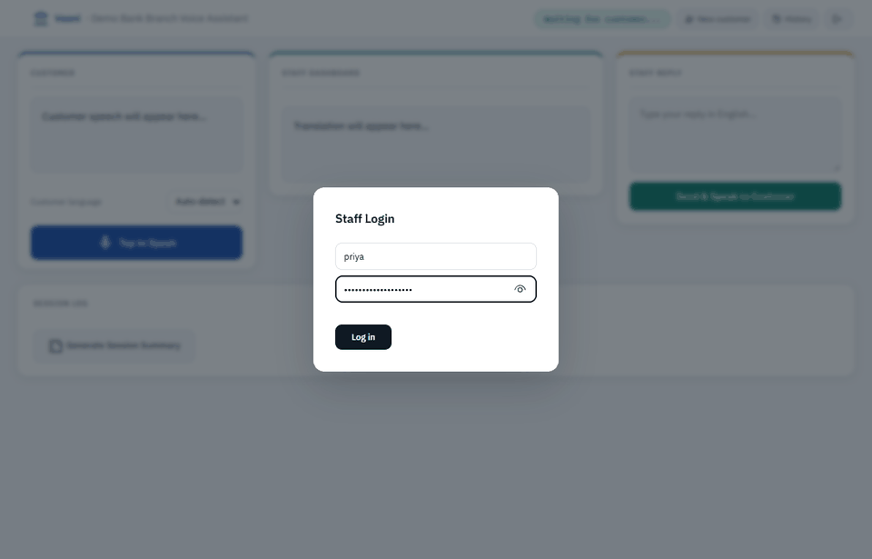
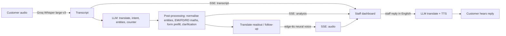

# Vaani

> Multilingual voice assistant for bank branch desks in India.

[](https://github.com/Shrutiiicodes/Vaani/actions/workflows/ci.yml)
[](https://python.org)
[](https://fastapi.tiangolo.com/)
[](LICENSE)



*A real recorded turn: Groq Whisper and Qwen, no mocks. Recorded with `docs/record_demo.py`.*

A customer walks up to the desk and speaks Tamil, Gujarati or Hindi. The staff member sees an English translation within a second. Vaani then shows the banking intent, the counter to send the customer to, a pre-filled form, the process checklist and any EMI or deposit calculation. The staff member types a reply in English, and the customer hears it in their own language.

## How it works



- **Streaming.** `/api/customer-speak` returns Server-Sent Events, so the transcript appears as soon as Whisper finishes, before the LLM and TTS are done.
- **The LLM does language, Python does money.** The model only extracts amounts and tenures. EMI, FD/RD maturity and loan eligibility are computed deterministically from one rate table, which the dashboard also renders.
- **Defensive LLM handling.** The model runs in JSON mode, and its output is validated with Pydantic. Unparseable output falls back to a plain translation and is logged, never a 500. Entities are normalised: "50 lakhs" becomes 5000000 and "3 years" becomes 36 months.
- **Clarification.** A vague request like "मुझे पैसे चाहिए" ("I need money") triggers a spoken follow-up question. It could mean a cash withdrawal, a loan or breaking an FD.

## Results

All numbers below are measured with real Groq calls. Full tables and methodology are in [backend/eval](backend/eval/README.md).

### Language understanding

This benchmark has 150 gold-text cases across 9 languages, including 13 code-mixed Hinglish cases and 8 deliberately vague requests. It measures the pipeline given a correct transcript.

| | Qwen3.8-27b (default) | gpt-oss-120b | Original pipeline |
|---|---:|---:|---:|
| Intent accuracy (16 intents) | 100% | 99.3% | 98.3% |
| Entity extraction F1 | 1.00 | 1.00 | 0.68 |
| Counter routing | 100% | 99.3% | 95.0% |
| Clarifying question on vague requests | 8 / 8, no false alarms | 8 / 8, no false alarms | not measured |
| LLM latency p50 / p95 | 0.50 s / 0.82 s | 1.05 s / 1.90 s | 3.38 s / 4.46 s |
| Translation BLEU vs. reference | 70.3 | 72.2 | not measured |

- **The original pipeline** is `llama-3.3-70b-versatile` on the original 60 cases. Groq has since retired that model. On those same 60 cases, both new configurations score 100% intent and 1.00 entity F1. The old pipeline dropped tenures given in years, "50 lakhs" style amounts and account types.
- **This is not a held-out test.** The first run on this set scored 94.0% intent and 0.95 entity F1 with gpt-oss. I then added post-processing rules to fix the failures I saw: vague money requests labelled as cash withdrawals, missing account types and inconsistent routing. The scores above are after that tuning, so expect lower accuracy on new phrasings. A fresh held-out set is the next step.
- **Other limits.** Entity scoring covers 90 annotated slots: amounts, tenures, loan and account types, and nominee relations. The non-English cases have not yet been reviewed by native speakers.

### Speech recognition

These are 32 clips in 8 languages, voiced by neural TTS.

| Whisper large-v3 | Auto-detect | With the staff's language hint |
|---|---:|---:|
| Language identified correctly | 20 / 32 | 32 / 32 |
| Word error rate | 55.4% | 31.7% |
| Character error rate | 36.9% | 11.3% |

Auto-detect hears Gujarati, Marathi and Bengali as Hindi and writes them in the wrong script. The reply would then be spoken in the wrong language, which is why the dashboard has a language picker. Hindi, Tamil and English stay under 7% character error rate in both modes. Synthetic clips are clean studio speech, so real branch audio will do worse.

### Latency under load

This test sends real customer turns carrying the same Hindi home-loan request, with every stage running. Both versions used gpt-oss-120b, and the original code differs only in having the retired model name swapped.

| | Original code | This version |
|---|---:|---:|
| First text on the staff screen, 1 turn | 3.36 s | 0.72 s |
| Full turn including spoken reply, 1 turn | 3.36 s | 3.74 s |
| 4 concurrent turns, total p50 / p95 | 8.71 s / 11.23 s | 5.97 s / 6.17 s |

The original server used a blocking Groq client, so simultaneous customers queued behind each other. A single full turn is slightly slower now because the neural voices take about 1 s longer than gTTS; `TTS_ENGINE=gtts` trades that back. Stage timings for one turn were 690 ms for speech-to-text, 1,200 ms for the LLM and 1,807 ms for translation plus speech.

## Features

- 16 intents, including cash withdrawal and deposit, account opening, KYC, loans, Mudra, Kisan Credit Card, FD/RD, fund transfer, cheques, cards, TDS certificates and complaints.
- Counter routing, step-by-step process guides and pre-filled forms for account opening, KYC, loans, FDs and transfers.
- Speech output in 8 languages with Microsoft neural voices, falling back to gTTS.
- Staff accounts with an admin role. Each staff member only sees their own sessions, and sessions can be summarised and revisited from a history view.
- Per-request JSON logs with a request ID and per-stage timings (`stt_ms`, `llm_ms`, `speech_ms`).

## Quick start

```bash
git clone https://github.com/Shrutiiicodes/Vaani.git
cd Vaani
python -m venv venv
source venv/bin/activate            # Windows: .\venv\Scripts\Activate.ps1
pip install -r requirements.txt
cp .env.example .env                # then fill in GROQ_API_KEY, JWT_SECRET, STAFF_PASSWORD
cd backend
uvicorn main:app --reload
```

Open http://localhost:8000 and log in as `admin` (or your `STAFF_USERNAME`) with `STAFF_PASSWORD`. API docs are at `/docs`. Add more staff with `POST /api/staff` as the admin.

With Docker:

```bash
docker compose up --build
```

Sessions persist in `./data/vaani.db`.

## Configuration

Every setting is listed in [.env.example](.env.example). The ones that matter most:

| Variable | Default | Notes |
|---|---|---|
| `GROQ_API_KEY` | required | Whisper and the LLM both run on Groq. |
| `JWT_SECRET` | required | Any long random string. |
| `STAFF_PASSWORD` | required | Bootstrap admin password, re-applied on every start. |
| `LLM_MODEL` | `qwen/qwen3.8-27b` | Picked by benchmark. `openai/gpt-oss-120b` is the tested alternative. Groq retired `llama-3.3-70b-versatile`, which this project originally used. |
| `DATABASE_URL` | SQLite in the temp dir | Set a `postgres://` URL for Postgres (Neon, Supabase, Render). |
| `TTS_ENGINE` | `edge` | `gtts` is about 1 s faster per reply but sounds robotic. |

## API

| Method | Endpoint | Auth | Purpose |
|---|---|---|---|
| `POST` | `/api/login` | | Username + password, returns a 30-minute JWT |
| `POST` | `/api/logout` | staff | Revokes the token |
| `POST` | `/api/staff` | admin | Creates a staff account |
| `POST` | `/api/customer-speak` | staff | Audio in, SSE out: `transcript`, `analysis`, `audio`, `done` |
| `POST` | `/api/staff-reply` | staff | English reply in, translated text and speech out |
| `POST` | `/api/summary` | staff | Bilingual session summary, saved to the session |
| `GET` | `/api/sessions` | staff | Your recent sessions (admins see all) |
| `GET` | `/api/session/{id}` | staff | Turns of one session |
| `GET` | `/api/rates` | | Bank name, loan rates, FD slabs, supported languages |
| `GET` | `/health` | | Liveness |

## Testing

```bash
pip install -r requirements-dev.txt
pytest                 # 82 tests, no API key needed: Groq and TTS are faked
ruff check backend api
```

CI runs lint and tests, re-scores the saved eval results, and builds the Docker image and checks its health endpoint. Accuracy and latency evaluation lives in [backend/eval](backend/eval/README.md).

## Deploy

[](https://render.com/deploy?repo=https://github.com/Shrutiiicodes/Vaani)

The button reads [render.yaml](render.yaml). Render asks for your `GROQ_API_KEY` and a `STAFF_PASSWORD`, generates the JWT secret, builds the Dockerfile and checks `/health`. Log in as `admin`.

- **Free plan caveats.** The service sleeps after 15 minutes idle, so the first request after that takes about a minute. Its disk is wiped on every restart, so sessions do not persist. To keep them, add a `DATABASE_URL` from a free Postgres such as [Neon](https://neon.tech). The app already speaks Postgres.
- **Vercel** (`vercel.json`) is untested end to end. Serverless needs `DATABASE_URL` pointing at Postgres, and response streaming may be buffered.
- **Several workers.** Token revocation and the translation cache live in process memory, so a logout is only honoured by the worker that received it.
- **Rates are illustrative.** The rates in `backend/banking_context.py` are demo values, not any bank's published rates.

## Known limitations

- Whisper does not support Odia, and no TTS voice exists for it. Odia text is handled, but Odia speech is not transcribed reliably and replies are text-only.
- The non-English eval cases have not yet been reviewed by native speakers.
- The speech-to-text numbers come from synthetic neural-TTS clips. Real branch audio, with noise and accents, will be worse. The eval accepts human recordings as soon as someone records them.

## License

MIT. See [LICENSE](LICENSE).
