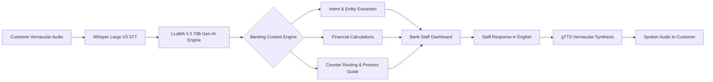

# Vaani

> **Frontline Desk Support in Multilingual Mode Using Gen-AI Voice Assistant**

[](https://python.org)
[](https://fastapi.tiangolo.com/)
[](https://groq.com/)
[](https://www.docker.com/)
[](LICENSE)

**Vaani** is an enterprise Gen-AI voice intelligence platform designed for bank branch desks across India. It bridges regional language barriers between bank staff and customers by providing real-time speech translation, automated intent classification, structured entity extraction, smart counter routing, and instant financial calculations.

---

## Key Features

- **Multilingual Speech Recognition (STT):** Real-time audio transcription powered by **Whisper Large V3** on Groq, supporting **9 Indian languages**:
  - Hindi (`hi`), Tamil (`ta`), Telugu (`te`), Marathi (`mr`), Bengali (`bn`), Gujarati (`gu`), Kannada (`kn`), Odia (`or`), and English (`en`).
- **Gen-AI Intent & Entity Engine:** Driven by **LLaMA 3.3 70B**, classifying **15 banking intents** and extracting key operational entities (amounts, account numbers, names, tenures).
- **Intelligent Counter Routing:** Dynamically advises staff on the target service desk (*Cash Counter, Service Desk, Specialized Loan Counter, Investment Desk, Operational Supervisor, Branch Manager*).
- **Automated Financial Calculator:** Computes exact financial figures on the fly:
  - **EMI Calculator** for 8 loan categories (Home, Personal, Vehicle, Gold, Education, MSME, KCC, Mudra).
  - **Deposit Maturity Calculator** for Fixed Deposits (FD) and Recurring Deposits (RD).
  - **Loan Eligibility Evaluator** based on income and existing obligations.
- **Vernacular Voice Output (TTS):** Synthesizes natural spoken responses back to customers in their preferred native language via **gTTS**.
- **Step-by-Step Staff Action Guides:** Displays context-aware process checklists and required document verification steps for branch personnel.
- **Enterprise Security & Control:** JWT-based staff authentication, session state persistence (SQLite + SQLAlchemy), rate-limiting via `SlowAPI`, and CORS defense.

---

## Architecture & Pipeline



---

## Project Structure

```
Vaani-Main/
├── backend/
│   ├── main.py              # FastAPI application server & REST endpoints
│   ├── stt.py               # Speech-to-Text via Groq Whisper V3 API
│   ├── translate.py         # LLaMA 3.3 translation, intent & calculation pipeline
│   ├── tts.py               # Text-to-Speech generation (gTTS base64)
│   ├── banking_context.py   # Intent definitions, process guides & financial rules
│   ├── auth.py              # JWT authentication & password verification
│   ├── database.py          # SQLAlchemy SQLite configuration
│   ├── models.py            # Pydantic & ORM database schemas
│   ├── crud.py              # Session persistence & turn history CRUD
│   ├── eval/                # Benchmark dataset & accuracy evaluation scripts
│   │   ├── test_cases.json
│   │   └── run_eval.py
│   └── tests/               # Pytest unit tests for financial engine
│       └── test_calculations.py
├── frontend/
│   ├── index.html           # Web dashboard UI for bank staff & customers
│   ├── app.js               # Web Audio API recording, session management & API integration
│   └── style.css            # Responsive UI glassmorphism design system
├── evaluation_guide.md      # Evaluation metrics, evaluation playbook & resume benchmarks
├── Dockerfile               # Production container definition
├── docker-compose.yml       # Docker deployment specification
├── requirements.txt         # Python dependencies
└── README.md                # Project documentation
```

---

## Quick Start Guide

### Prerequisites

- **Python:** 3.11 or higher
- **Groq API Key:** Obtain an API key from [Groq Console](https://console.groq.com/)

### 1. Local Setup

1. **Clone the Repository:**
   ```bash
   git clone https://github.com/Shrutiiicodes/Vaani.git
   cd Vaani-Main
   ```

2. **Create a Virtual Environment:**
   ```bash
   python -m venv venv
   # On Windows (PowerShell):
   .\venv\Scripts\Activate.ps1
   # On Linux/macOS:
   source venv/bin/activate
   ```

3. **Install Dependencies:**
   ```bash
   pip install -r requirements.txt
   ```

4. **Configure Environment Variables:**
   Create or edit the `.env` file in the project root:
   ```env
   GROQ_API_KEY=your_groq_api_key_here
   JWT_SECRET=your_jwt_secret_key
   STAFF_PASSWORD=your_staff_password
   ```

5. **Start the FastAPI Server:**
   ```bash
   cd backend
   uvicorn main:app --host 0.0.0.0 --port 8000 --reload
   ```

6. **Access the Web Dashboard:**
   Open your browser and navigate to:
   - Dashboard UI: [http://localhost:8000](http://localhost:8000)
   - OpenAPI Docs: [http://localhost:8000/docs](http://localhost:8000/docs)

---

## Docker Deployment

Run Vaani effortlessly using Docker and Docker Compose:

```bash
# Build and start container
docker-compose up --build -d

# View application logs
docker-compose logs -f

# Stop container
docker-compose down
```

---

## API Endpoint Reference

| Method | Endpoint | Description | Auth Required |
| :--- | :--- | :--- | :--- |
| `POST` | `/api/login` | Authenticates bank staff & returns JWT token | ❌ |
| `POST` | `/api/logout` | Revokes active JWT session token | 🔐 Yes |
| `POST` | `/api/customer-speak` | Processes customer audio → STT → Intent → Calculations | 🔐 Yes |
| `POST` | `/api/staff-reply` | Translates staff English reply → Customer native audio | 🔐 Yes |
| `POST` | `/api/translate-text` | Direct text translation between supported languages | 🔐 Yes |
| `POST` | `/api/summary` | Generates structured interaction summary for CRM | 🔐 Yes |
| `GET`  | `/api/counters` | Lists all branch counter routing mapping | ❌ |
| `GET`  | `/api/session-history` | Fetches historical session conversation turns | 🔐 Yes |

---

## Testing & Evaluation

### Running Unit Tests
Validate financial calculators (EMI, FD/RD, loan eligibility):
```bash
pytest backend/tests/
```

### Running Accuracy & Benchmark Evaluation
Evaluate model intent classification accuracy, counter routing, and translation scores (BERTScore / BLEU):
```bash
python backend/eval/run_eval.py
```

*For detailed instructions on running evaluation experiments and resume metric formulas, check [`evaluation_guide.md`](file:///c:/Users/asus/Projects/Vaani-Main/evaluation_guide.md).*

---

## License

Distributed under the MIT License. See `LICENSE` for details.
